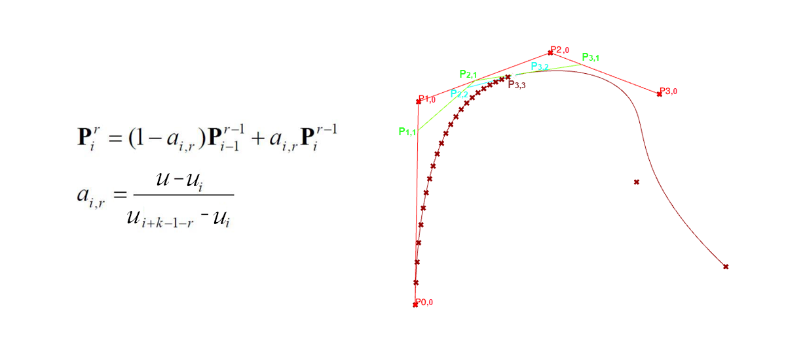
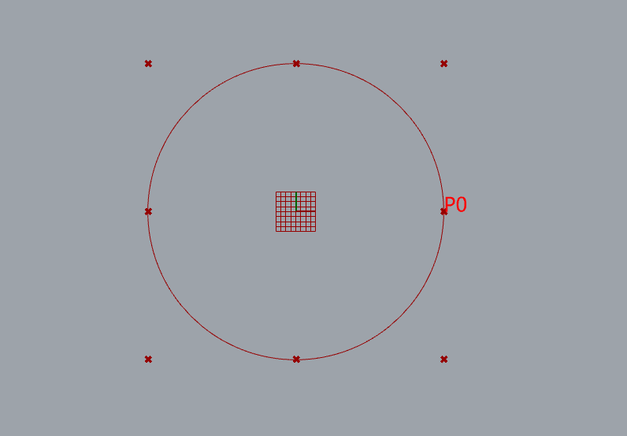
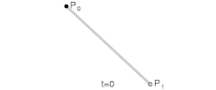
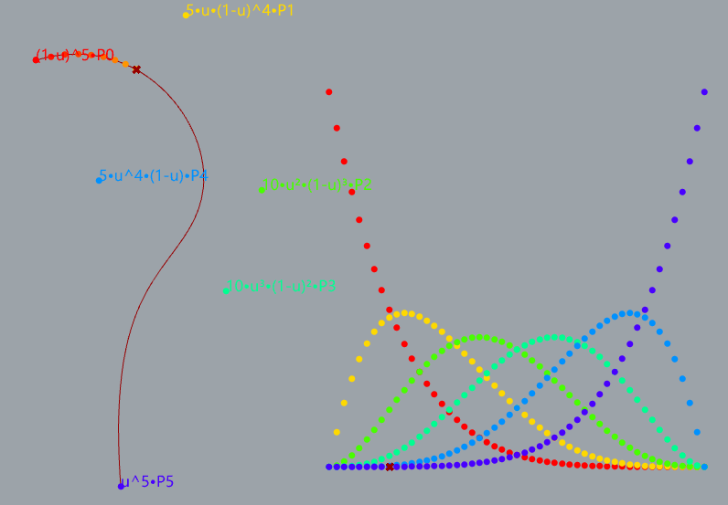

# NURBS曲线DeBoor算法(Grasshopper数学插件)

* 版本 0.0.2 alpha  
* 版权 (c) 2019-2020 mahaidong
* Github源码下载: [https://github.com/caadxyz/DeBoorAlgorithmNurbs](https://github.com/caadxyz/DeBoorAlgorithmNurbs)
* Supported by ikuku.cn & caad.xyz 

[English](readme.md)

# 这个插件能做什么?

### 演示Nurbs曲线的DeBoor算法

仅仅靠自己的抽象想象力去理解不同的控制点位置(point)、权重向量(weight)和结点向量(knot)对NURBS曲线的影响是很难获得直观的理解与认识的. 

这个grasshopper组件可以让你通过设定曲线的度数、控制点、重量向量和结点向量来演示如何生成NURBS曲线。其结果是让用户可以直观的看到最一般意义上的NURBS曲线的生成. 

同时在曲线的绘制的时, 直接展示了与DeBoor算法相关的辅助线,及辅助线如何生成曲线.

DeBoor算法参考文献: https://pages.mtu.edu/~shene/COURSES/cs3621/NOTES/spline/de-Boor.html

**什么是DeBoor算法?**

* DeBoor算法是DeCasteljau算法的B-spline版本
* 通过DeBoor算法可以精准的描绘B-spline
* 通过控制点及结点向量knot的值u,通过递归求得曲线上的点的位置
* DeBoor算法也可以用于Nurbs曲线的生成



BSpline的DeBoor算法伪代码, python源码见[github](https://github.com/caadxyz/DeBoorAlgorithmNurbs)

```
Input: a value u
Output: the point on the curve, p(u)

If u lies in [uk,uk+1) and u != uk, let h = p (i.e., inserting u p times) and s = 0;
If u = uk and uk is a knot of multiplicity s, let h = p - s (i.e., inserting u p - s time);
Copy the affected control points pk-s, pk-s-1, pk-s-2, ..., pk-p+1 and pk-p to 
a new array and rename them as pk-s,0, pk-s-1,0, pk-s-2,0, ..., pk-p+1,0;

for r := 1 to h do
    for i := k-p+r to k-s do
        begin
            Let ai,r = (u - ui) / ( ui+p-r+1 - ui )
            Let pi,r = (1 - ai,r) pi-1,r-1 + ai,r pi,r-1
        end
pk-s,p-s is the point p(u).
```

**5阶BSpline的演示**


10个控制点  
knots= [0, 0, 0, 0, 0, 1, 2, 3, 4, 5, 5, 5, 5, 5]  
weight= [1, 1, 1, 1, 1, 1, 1, 1, 1,1]  


**NURBS曲线的DeBoor算法**    
De Boor的算法也适用于NURBS曲线。我们只需将每个控制点乘以它的权重，将NURBS曲线转换为4D B-spline曲线，在这条4D B-spline曲线上执行de Boor算法，然后将得到的曲线上的点的xyz除以w，就可以将曲线投影回来. python源码见[github](https://github.com/caadxyz/DeBoorAlgorithmNurbs)

**圆的Nurbs拟合演示**



9个控制点  
knots= [0, 0, 1, 1, 2, 2, 3, 3, 4, 4]  
weight=[1, 0.707107, 1, 0.707107, 1, 0.707107, 1, 0.707107, 1]  


### 演示Bezier曲线与Bernstein多项式

**参数曲线的范畴**  


**什么是Bezier曲线**

Bezier曲线的数学基础--伯恩斯坦多项式--早在1912年就已为人所知，但直到大约50年后，法国工程师皮埃尔-贝兹尔（Pierre Bézier）才将这些多项式应用于图形，并将其广泛宣传，他用它们在雷诺公司设计汽车车身。这些曲线的研究最早是在1959年由数学家Paul de Casteljau利用de Casteljau的算法发展起来的，该算法是一种数值稳定的方法，用于评估法国另一家汽车制造商Citroën的Bézier曲线

关于Bernstein多项式的介绍见: [http://www.ikuku.cn/post/1872817 ](http://www.ikuku.cn/post/1872817)

**Bezier曲线的数学公式**

Bernstein多项式  


其中:  


n阶贝塞尔曲线的定义  

  


n=1:  
当n=1的时候可以用来表示直线.  

  

  


n=2:  
当n=2的时候可以用来表示曲线.  
  

  

**5阶贝塞尔曲线的演示**




### 如何安装与使用?

**方法一**  
* 拷贝dist文件夹中的ghuser 文件到 User Objects 文件夹
* 打开dist文件夹中的案例文件 DeBoorAlgorithmNurbs.gh 查看演示效果

**方法二**  
* 打src文件夹中的案例文件 DeBoorAlgorithmNurbs.gh 查看演示效果

**b-spline**:  


**nurbs circle**:  


**bezier curve**:  


### todo

 * Single Insertion 
 * Inserting a Knot Multiple Times
 * compute tangent and normal vectors at a point on a Bézier curve
 * b-spline surface 
 * curve interpolation

### 许可证

你可以根据自由软件基金会发布的GNU Lesser General Public License版本3的条款重新发布它和/或修改它。
