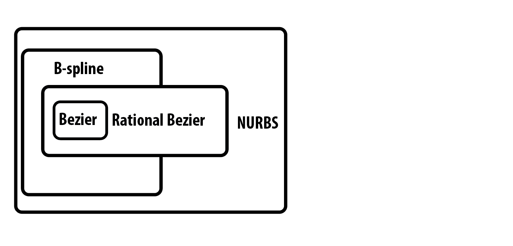
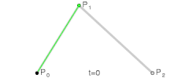
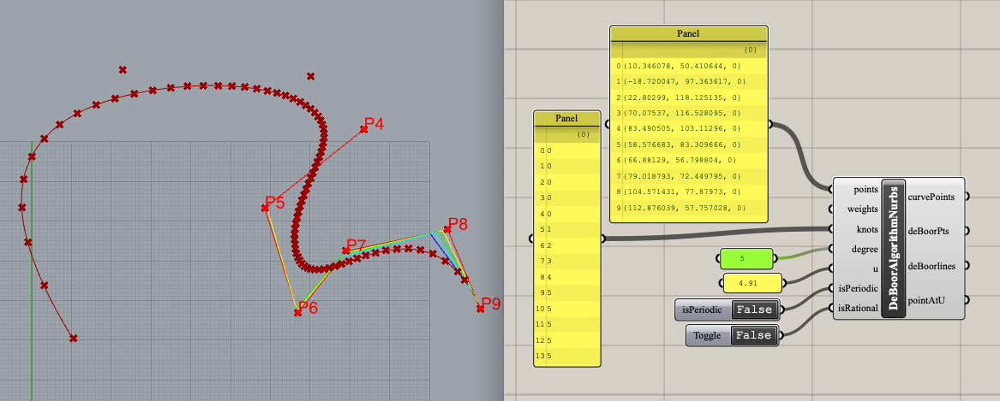
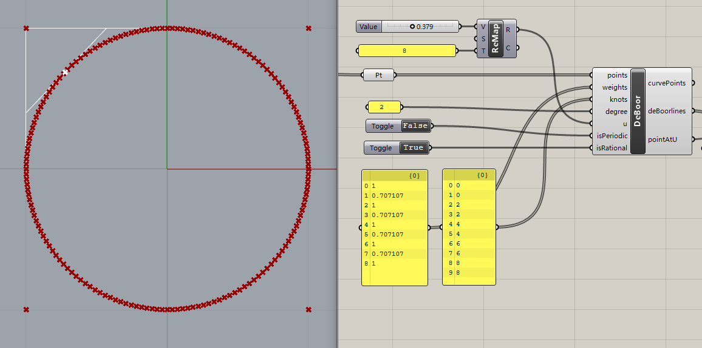
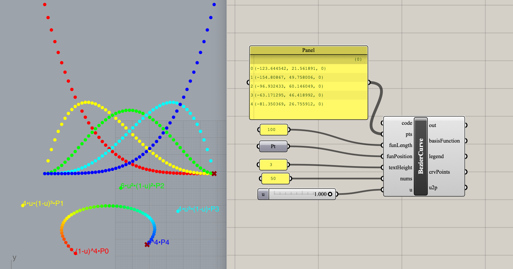

# De Boor's Algorithm for NURBS Curve

* verion 0.0.2  
* Copyright (c) 2019-2020 mahaidong
* github https://github.com/caadxyz/DeBoorAlgorithmNurbs
* Supported by ikuku.cn & caad.xyz 

[中文](readme-cn.md)

### What is this plugin?

#### Demostrate De Boor's Algorithm for Nurbs

Gaining an intuitive understanding for NURBS is difficult without directly seeing the effects of different control point position, weight vectors, and  knot vectors.

This grasshopper component allows you demonstrate NURBS curves by specifying the degree of the curve, control points, weight vector and the knot vector. 

This allows the user to see NURBS curves in its most general sense.

De Boor's Algorithm reference: https://pages.mtu.edu/~shene/COURSES/cs3621/NOTES/spline/de-Boor.html

#### what is De Boor's Algorithm?

* The de boor's  algorithm is a B-spline version of the DeCasteljau algorithm
* A precise method to evaluate the curve
* Starting from control points and parameter value u, recursively solve.
* de boor's algorithm can also be used for Nurbs curve generation


BSpline's DeBoor Algorithm Pseudocode, python code: [github](https://github.com/caadxyz/DeBoorAlgorithmNurbs)

```
Input: a value u
Output: the point on the curve, p(u)

If u lies in [uk,uk+1) and u != uk, let h = p (i.e., inserting u p times) and s = 0;
If u = uk and uk is a knot of multiplicity s, let h = p - s (i.e., inserting u p - s time);
Copy the affected control points pk-s, pk-s-1, pk-s-2, ..., pk-p+1 and pk-p to 
a new array and rename them as pk-s,0, pk-s-1,0, pk-s-2,0, ..., pk-p+1,0;

for r := 1 to h do
    for i := k-p+r to k-s do
        begin
            Let ai,r = (u - ui) / ( ui+p-r+1 - ui )
            Let pi,r = (1 - ai,r) pi-1,r-1 + ai,r pi,r-1
        end
pk-s,p-s is the point p(u).
```

#### Demostrate 5-degree BSpline


10 control points  
knots= [0, 0, 0, 0, 0, 1, 2, 3, 4, 5, 5, 5, 5, 5]  
weight= [1, 1, 1, 1, 1, 1, 1, 1, 1,1]  

#### de boor's algorithm for NURBS curves  

De Boor's algorithm also works for NURBS curves. We just multiply every control point by its weight converting the NURBS curve to a 4D B-spline curve, perform de Boor's algorithm on this 4D B-spline curve, and then project the resulting curve back by dividing the first three components with the fourth and keeping the fourth component as its new weight.

The python source code is available at [github](https://github.com/ caadxyz/DeBoorAlgorithmNurbs)


#### Demonstrate a NURBS to fit circle  


9 control points  
knots= [0, 0, 1, 1, 2, 2, 3, 3, 4, 4]  
weight=[1, 0.707107, 1, 0.707107, 1, 0.707107, 1, 0.707107, 1]  


### Bezier Curve with Bernstein Polynomial

#### category of parametric curves  



#### what is bezier curve

The mathematical basis of the Bezier curve - the Bernstein polynomial - was known as early as 1912, but it was not until approximately It was 50 years before French engineer Pierre Bézier applied these polynomials to the graphics and advertised them widely, and he used them to design car bodies at Renault. These curves were first studied in 1959 by mathematician Paul de Casteljau using de Casteljau's algorithm was developed as a numerically stable method for evaluating another French automotive Bézier curve from the manufacturer Citroën

The Detail of Bernstein Polynomial: [http://www.ikuku.cn/post/1872817 ](http://www.ikuku.cn/post/1872817)

**The mathermatical formula for bezier curve**

Bernstein Polynomial  


In which:  


Definition of n-degree bezier curve  

  


n=1:  
It can be a line  

  

  


n=2:  

  

  

#### demostrate 5-degree bezier curve


### install and use

* copy ghuser file to User Objects Folder
* open sample file  DeBoorAlgorithmNurbs.gh to see the result


**b-spline**:  


**nurbs circle**:  


**bezier curve**:  


### todo

 * Single Insertion 
 * Inserting a Knot Multiple Times
 * compute tangent and normal vectors at a point on a Bézier curve
 * b-spline surface 
 * curve interpolation

### License

You can redistribute it and/or modify it under the terms of the GNU Lesser General Public License version 3 as published by the Free Software Foundation.
